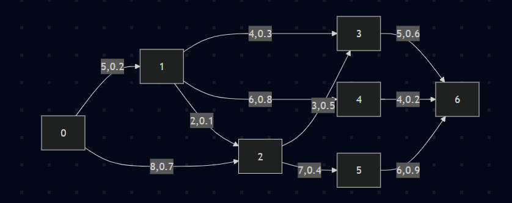

# Smart Navigation System

## Team
* Jenish Pancholi (IU2441230510)
* Jainesh Patel (IU2441230479)
* Nandan Khagram (IU2441230558)

## Problem Statement
In real-world navigation, the shortest path is not always the fastest. Traffic conditions affect travel time, but basic algorithms often ignore this. This project improves pathfinding by combining graph algorithms with a simple machine learning model.

## Project Overview
* Road Network: Modeled as a directed graph.
* Nodes: Locations.
* Edges: Roads.

Each edge stores:
* Distance
* Traffic
* Predicted travel time

A Linear Regression model predicts travel time using distance and traffic. Finally, Dijkstra’s Algorithm is used to find the fastest path based on predicted time.

## Graph Representation

### Edge List Representation
0 -> 1 (5, 0.2)
0 -> 2 (8, 0.7)
1 -> 3 (4, 0.3)
1 -> 4 (6, 0.8)
1 -> 2 (2, 0.1)
2 -> 3 (3, 0.5)
2 -> 5 (7, 0.4)
3 -> 6 (5, 0.6)
4 -> 6 (4, 0.2)
5 -> 6 (6, 0.9)

### Graph Visualization

  

Format: (distance, traffic)

## Data Structures
### Graph (Adjacency List)
* `vector<vector<Edge>>`
* Efficient for sparse graphs.

### Edge
Stores:
* Destination
* Distance
* Traffic
* Predicted time

### Priority Queue (Min-Heap)
* Used in Dijkstra’s Algorithm.
* Selects node with minimum cost.

### Stack
* Reconstructs final path from destination to source.

## Linear Regression Model
The travel time is calculated using:
$time = w1 \cdot distance + w2 \cdot traffic + b$

* Training: Uses sample data (distance, traffic → time) optimized with **Gradient Descent**.
* Loss Function: $MSE = \frac{1}{n} \sum (predicted - actual)^2$
* Updates: Weights ($w1$, $w2$) and bias ($b$) are adjusted to minimize error.

## Why Dijkstra’s Algorithm?
* Weighted Graphs: Uses predicted travel time as the cost.
* Optimality: Guarantees the fastest path.
* Why not BFS? It ignores edge weights.
* Why not DFS? It is not optimal for finding the shortest path.

## Advantages
* Hybrid Logic: Combines ML + traditional algorithms.
* Realism: More accurate than fixed distance formulas.
* Adaptability: Accounts for dynamic traffic conditions.

## Limitations
* Small training dataset.
* Simple model (only 2 features).
* Assumes static traffic values during the search.

## Conclusion
This system predicts travel time using distance and traffic, then applies Dijkstra’s Algorithm to find the fastest route. It demonstrates how machine learning can enhance traditional graph algorithms.